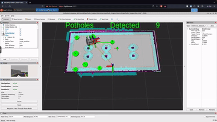

# Autonomous Pothole Inspector

The Autonomous Pothole Inspector (API) is a ROS2 stack that performs navigation and detection of potholes on public roads. It has the following main components:

- **Object Detection Node**: Runs a neural network to detect potholes from RGB camera image. Publishes detections as bounding boxes.
- **Detection Aggregation Node**: Maintain a list of detected potholes, their location, dimensions and image. Merges multiple detections of the same pothole.
- **Waypoint Mission Node**: Instruct the robot to navigate through a series of waypoints to cover the inspection area. Interfaces with the Nav2 stack for localisation, planning and control.
- **Report Generator Node**: Implements a service interface to generates a inspection report detailing the list of detected potholes and a map with there locations.

# Getting Started

## Install Dependencies

```sh
> sudo apt update && sudo apt install -y ros-humble-vision-msgs-rviz-plugins
```

## Build

To build the stack, run the following:

```sh
> colcon build --packages-select pothole_inspection && . install/setup.bash 
```

## Run

To launch the full stack in simulation:

```sh
ros2 launch pothole_inspection sim.launch.py skip_localisation_init:=true
```

This will launch the inspection stack, Gazebo simulator and RViz. 



The robot will navigate through the arena and produce a report at the end. The report can be viewed at `/tmp/inspection_report`. An example report can be found [here](example_inspection_report/report.md)

## Training Detection Model

A neural network model (FastRCNN with a ResNet-50 backbone) is trained to detect pothole. Pre-trained model is found in [./models](./models/). Labeled training data can be found in [./pothole_images](./pothole_images/). To train the model, run the jupyter notebook [./training/detection.ipynb](./training/detection.ipynb).

## Waypoints

Waypoints are recorded as a rosbag and can be found in [./waypoints](./waypoints/).
To record waypoints, use the **Nav2 Goals** tool in RViz, then run the following command to record it as a rosbag:

```sh
> ros2 bag record --storage mcap /waypoints -o <output_folder>
```
